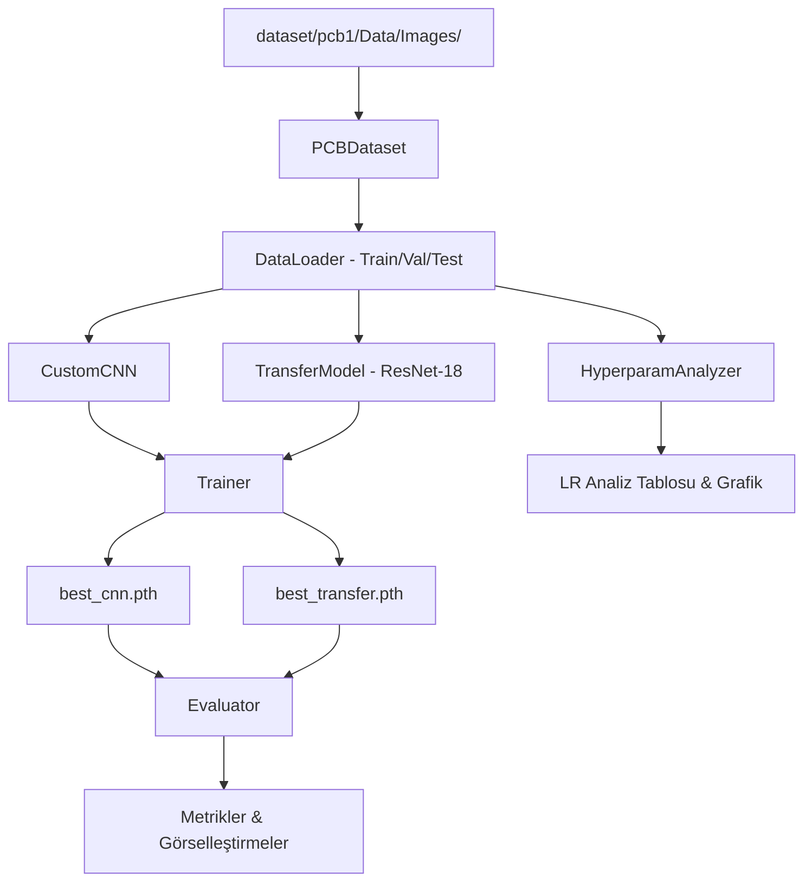
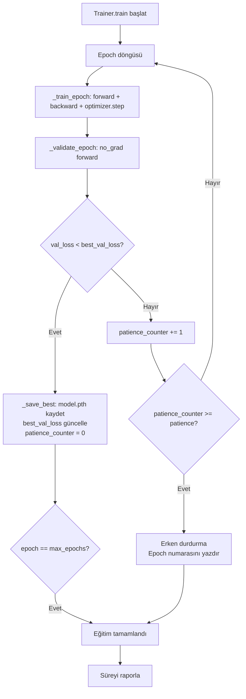
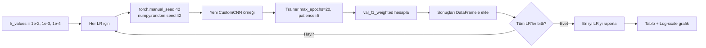

# Tasarım Belgesi: PCB Anomali Tespiti

## Genel Bakış

Bu proje, SPOT-Diff veri setinden alınan PCB (Baskılı Devre Kartı) görüntüleri üzerinde derin öğrenme tabanlı ikili sınıflandırma (Normal / Anomaly) gerçekleştiren bir sistem tasarlamaktadır. Temel zorluk, ~10:1 sınıf dengesizliğidir (1004 Normal, 100 Anomaly). Sistem iki farklı mimariyi karşılaştırır: sıfırdan tasarlanmış özel bir CNN ve ImageNet ağırlıklarıyla önceden eğitilmiş ResNet-18 tabanlı Transfer Learning modeli.

Tüm geliştirme ve deneyler tek bir Jupyter Notebook (`.ipynb`) dosyasında modüler Python sınıfları ve fonksiyonları aracılığıyla yürütülür. Apple Silicon M2 MacBook Air üzerinde MPS backend ile GPU hızlandırması sağlanır.

### Tasarım Kararları

- **Tek notebook yaklaşımı**: Tekrarlanabilirlik ve değerlendirilebilirlik için tüm kod, analiz ve görselleştirmeler tek `.ipynb` dosyasında toplanır.
- **Modüler sınıf yapısı**: `PCBDataset`, `CustomCNN`, `TransferModel`, `Trainer`, `Evaluator`, `HyperparamAnalyzer` sınıfları notebook hücrelerinde tanımlanır; kod tekrarı önlenir.
- **Sınıf dengesizliği çift strateji**: `WeightedRandomSampler` + ağırlıklı `CrossEntropyLoss` birlikte kullanılarak azınlık sınıfı (Anomaly) hem örnekleme hem kayıp hesaplama düzeyinde desteklenir.
- **MPS öncelikli cihaz seçimi**: MPS → CUDA → CPU öncelik sırası ile platform bağımsız çalışma sağlanır.

---

## Mimari

### Sistem Bileşenleri



### Notebook Bölüm Yapısı

```
pcb_anomaly_detection.ipynb
├── ## Bölüm 1: Giriş ve Kurulum
│   ├── Seed ayarları (torch, numpy, random = 42)
│   ├── Import'lar
│   ├── DATA_ROOT tanımı
│   └── Cihaz seçimi (MPS/CUDA/CPU)
├── ## Bölüm 2: Veri Analizi
│   ├── PCBDataset sınıfı tanımı
│   ├── Veri keşfi ve istatistikler
│   ├── Augmentation pipeline
│   └── DataLoader oluşturma
├── ## Bölüm 3: Model Tasarımı
│   ├── CustomCNN sınıfı
│   ├── TransferModel sınıfı
│   └── Parametre sayısı raporlama
├── ## Bölüm 4: Deneysel Çalışmalar
│   ├── Trainer sınıfı
│   ├── CNN eğitimi
│   ├── Transfer Learning eğitimi
│   └── HyperparamAnalyzer (LR analizi)
├── ## Bölüm 5: Sonuçlar ve Karşılaştırma
│   ├── Evaluator sınıfı
│   ├── Metrik hesaplama
│   ├── ROC / PR eğrileri
│   └── Karşılaştırma tablosu
└── ## Bölüm 6: Tartışma
    ├── Overfitting analizi
    ├── Yanlış sınıflandırma görselleştirmesi
    └── Model önerisi
```

---

## Bileşenler ve Arayüzler

### PCBDataset Sınıfı

```python
class PCBDataset(Dataset):
    def __init__(self, image_paths: List[str], labels: List[int],
                 transform: Optional[transforms.Compose] = None)
    def __len__(self) -> int
    def __getitem__(self, idx: int) -> Tuple[torch.Tensor, int]
    
    @staticmethod
    def discover_files(data_root: str) -> Tuple[List[str], List[int]]
    # Döndürür: (image_paths, labels) - Normal=0, Anomaly=1
```

**Sorumluluklar:**
- `data_root/Normal/` ve `data_root/Anomaly/` dizinlerini tarar
- Bozuk dosyaları `WARNING:` önekiyle loglar, atlar
- Eksik dizin durumunda `FileNotFoundError` fırlatır
- `transform` pipeline'ını uygular

### DataLoader Fabrika Fonksiyonu

```python
def create_dataloaders(
    data_root: str,
    batch_size: int = 32,
    num_workers: int = 0,   # MPS uyumluluğu için 0
    seed: int = 42
) -> Tuple[DataLoader, DataLoader, DataLoader, Dict]
# Döndürür: (train_loader, val_loader, test_loader, class_weights_dict)
```

**Bölme stratejisi:** `train_test_split` ile stratifiye örnekleme, seed=42
- Eğitim: %70 → `WeightedRandomSampler` ile 1:1 örnekleme
- Doğrulama: %15 → sıralı örnekleme
- Test: %15 → sıralı örnekleme

### CustomCNN Sınıfı

```python
class CustomCNN(nn.Module):
    def __init__(self, dropout_rate: float = 0.5)
    def forward(self, x: torch.Tensor) -> torch.Tensor
    # Giriş: (B, 3, 224, 224) → Çıkış: (B, 2) ham logit
    
    def count_parameters(self) -> Dict[str, int]
    # Döndürür: {"total": N, "trainable": M}
```

### TransferModel Sınıfı

```python
class TransferModel(nn.Module):
    def __init__(self, backbone: str = "resnet18", dropout_rate: float = 0.5)
    def forward(self, x: torch.Tensor) -> torch.Tensor
    # Giriş: (B, 3, 224, 224) → Çıkış: (B, 2) ham logit
    
    def freeze_backbone(self) -> None
    def count_parameters(self) -> Dict[str, int]
```

### Trainer Sınıfı

```python
class Trainer:
    def __init__(self, model: nn.Module, device: torch.device,
                 class_weights: torch.Tensor,
                 lr: float = 1e-3,
                 max_epochs: int = 50,
                 patience: int = 10)
    
    def train(self, train_loader: DataLoader,
              val_loader: DataLoader,
              model_name: str) -> Dict[str, List[float]]
    # Döndürür: history = {
    #   "train_loss", "val_loss",
    #   "train_acc", "val_acc"
    # }
    
    def _train_epoch(self, loader: DataLoader) -> Tuple[float, float]
    def _validate_epoch(self, loader: DataLoader) -> Tuple[float, float]
    def _save_best(self, model_name: str) -> None
```

### Evaluator Sınıfı

```python
class Evaluator:
    def __init__(self, model: nn.Module, device: torch.device,
                 test_loader: DataLoader)
    
    def evaluate(self, model_name: str) -> Dict[str, float]
    # Döndürür: {"accuracy", "precision_macro", "recall_macro",
    #            "f1_macro", "f1_weighted", "roc_auc", "avg_precision"}
    
    def plot_confusion_matrix(self, model_name: str) -> None
    def plot_roc_curves(self, evaluators: List["Evaluator"],
                        names: List[str]) -> None
    def plot_pr_curves(self, evaluators: List["Evaluator"],
                       names: List[str]) -> None
    def plot_misclassified(self, model_name: str, n: int = 5) -> None
    def plot_training_history(self, history: Dict, model_name: str) -> None
```

### HyperparamAnalyzer Sınıfı

```python
class HyperparamAnalyzer:
    def __init__(self, train_loader: DataLoader, val_loader: DataLoader,
                 class_weights: torch.Tensor, device: torch.device)
    
    def run_lr_search(self, lr_values: List[float] = [1e-2, 1e-3, 1e-4],
                      max_epochs: int = 20,
                      patience: int = 5) -> pd.DataFrame
    # Döndürür: DataFrame(columns=["learning_rate", "val_f1_weighted"])
    
    def plot_lr_analysis(self, results: pd.DataFrame) -> None
```

---

## Veri Modelleri

### Görüntü Dönüşüm Pipeline'ları

**Eğitim Augmentation:**
```python
train_transform = transforms.Compose([
    transforms.Resize((224, 224)),
    transforms.RandomHorizontalFlip(p=0.5),
    transforms.RandomRotation(degrees=15),
    transforms.ColorJitter(brightness=0.1, contrast=0.1),
    transforms.ToTensor(),
    transforms.Normalize(mean=[0.485, 0.456, 0.406],
                         std=[0.229, 0.224, 0.225])
])
```

**Doğrulama/Test Dönüşümü:**
```python
val_test_transform = transforms.Compose([
    transforms.Resize((224, 224)),
    transforms.ToTensor(),
    transforms.Normalize(mean=[0.485, 0.456, 0.406],
                         std=[0.229, 0.224, 0.225])
])
```

### Sınıf Ağırlığı Hesaplama

```python
# Yalnızca eğitim bölümü kullanılır
n_normal  = sum(1 for l in train_labels if l == 0)
n_anomaly = sum(1 for l in train_labels if l == 1)
class_weights = torch.tensor([1.0/n_normal, 1.0/n_anomaly])
# CrossEntropyLoss(weight=class_weights)
```

### WeightedRandomSampler Ağırlıkları

```python
sample_weights = [
    1.0/n_normal  if label == 0 else 1.0/n_anomaly
    for label in train_labels
]
sampler = WeightedRandomSampler(
    weights=sample_weights,
    num_samples=len(train_labels),
    replacement=True
)
```

### Eğitim Geçmişi Sözlüğü

```python
history: Dict[str, List[float]] = {
    "train_loss": [],   # Her epoch eğitim kaybı
    "val_loss":   [],   # Her epoch doğrulama kaybı
    "train_acc":  [],   # Her epoch eğitim doğruluğu (0-100)
    "val_acc":    [],   # Her epoch doğrulama doğruluğu (0-100)
}
```

### Model Kayıt Formatı

```
best_cnn.pth       → torch.save(model.state_dict(), path)
best_transfer.pth  → torch.save(model.state_dict(), path)
```

---

## CNN Modeli Mimarisi

### Katman Detayları

```
Giriş: (B, 3, 224, 224)

── Blok 1 ──────────────────────────────────────
Conv2d(3, 32, kernel=3, padding=1)    → (B, 32, 224, 224)
BatchNorm2d(32)
ReLU()
MaxPool2d(kernel=2, stride=2)         → (B, 32, 112, 112)

── Blok 2 ──────────────────────────────────────
Conv2d(32, 64, kernel=3, padding=1)   → (B, 64, 112, 112)
BatchNorm2d(64)
ReLU()
MaxPool2d(kernel=2, stride=2)         → (B, 64, 56, 56)

── Blok 3 ──────────────────────────────────────
Conv2d(64, 128, kernel=3, padding=1)  → (B, 128, 56, 56)
BatchNorm2d(128)
ReLU()
MaxPool2d(kernel=2, stride=2)         → (B, 128, 28, 28)

── Sınıflandırıcı Başlık ───────────────────────
AdaptiveAvgPool2d((4, 4))             → (B, 128, 4, 4)
Flatten()                             → (B, 2048)
Linear(2048, 256)
ReLU()
Dropout(p=0.5)
Linear(256, 2)                        → (B, 2)  ← ham logit
```

**Tahmini parametre sayısı:** ~550K toplam, ~550K eğitilebilir

### Tasarım Gerekçesi

- `AdaptiveAvgPool2d` kullanımı: Sabit çıktı boyutu garantisi, farklı giriş boyutlarına esneklik
- `BatchNorm2d`: Eğitim stabilitesi, daha hızlı yakınsama
- `Dropout(0.5)`: Overfitting'e karşı düzenlileştirme (gereksinim: 0.3–0.6 aralığı)
- Ham logit çıktısı: `CrossEntropyLoss` ile doğrudan uyumluluk

---

## Transfer Learning Modeli Mimarisi

### ResNet-18 Tabanlı Yapı

```
Omurga: ResNet-18 (ImageNet ağırlıkları)

── Dondurulmuş Katmanlar (requires_grad=False) ──
conv1, bn1, relu, maxpool
layer1  (2 × BasicBlock, 64 filtre)
layer2  (2 × BasicBlock, 128 filtre)

── Eğitilebilir Katmanlar (requires_grad=True) ──
layer3  (2 × BasicBlock, 256 filtre)
layer4  (2 × BasicBlock, 512 filtre)
avgpool (AdaptiveAvgPool2d)

── Yeni Sınıflandırıcı Başlık ───────────────────
[Orijinal fc(512→1000) kaldırılır]
Linear(512, 256)
ReLU()
Dropout(p=0.5)
Linear(256, 2)                        → (B, 2)  ← ham logit
```

**Tahmini parametre sayısı:** ~11.2M toplam, ~4.2M eğitilebilir

### Dondurma Stratejisi Gerekçesi

- `layer1` ve `layer2` dondurulur: Düşük seviye özellikler (kenarlar, dokular) ImageNet'ten aktarılır
- `layer3` ve `layer4` eğitilebilir: PCB'ye özgü yüksek seviye özellikler öğrenilir
- Yeni başlık: 2 sınıf için özelleştirilmiş, Dropout ile overfitting kontrolü

---

## Eğitim Döngüsü Tasarımı

### Trainer Akış Diyagramı



### Optimizer ve Scheduler Konfigürasyonu

```python
optimizer = torch.optim.Adam(
    filter(lambda p: p.requires_grad, model.parameters()),
    lr=lr
)

scheduler = torch.optim.lr_scheduler.ReduceLROnPlateau(
    optimizer,
    mode='min',
    factor=0.5,
    patience=5
)

criterion = nn.CrossEntropyLoss(weight=class_weights.to(device))
```

### Early Stopping Mantığı

```python
best_val_loss = float('inf')
patience_counter = 0
PATIENCE = 10

for epoch in range(max_epochs):
    train_loss, train_acc = _train_epoch(train_loader)
    val_loss, val_acc = _validate_epoch(val_loader)
    scheduler.step(val_loss)
    
    if val_loss < best_val_loss:
        best_val_loss = val_loss
        patience_counter = 0
        _save_best(model_name)
    else:
        patience_counter += 1
        if patience_counter >= PATIENCE:
            print(f"Erken durdurma: Epoch {epoch+1}")
            break
```

---

## Hiperparametre Analizi Akışı



---

## Dosya Yapısı

```
derin_ogrenme_pcb/
├── pcb_anomaly_detection.ipynb   ← Ana notebook
├── requirements.txt               ← Bağımlılıklar
├── setup_env.sh                   ← Ortam kurulum betiği
├── README.md                      ← Proje dokümantasyonu
├── .gitignore                     ← venv/, *.pth, __pycache__/, .ipynb_checkpoints/
├── best_cnn.pth                   ← En iyi CNN ağırlıkları (eğitim sonrası)
├── best_transfer.pth              ← En iyi Transfer ağırlıkları (eğitim sonrası)
└── dataset/
    └── pcb1/
        └── Data/
            └── Images/
                ├── Normal/        ← ~1004 .JPG
                └── Anomaly/       ← ~100 .JPG
```

### requirements.txt İçeriği

```
torch>=2.0
torchvision>=0.15
scikit-learn>=1.3
matplotlib>=3.7
seaborn>=0.12
jupyter>=1.0
pandas>=2.0
numpy>=1.24
Pillow>=9.0
ipykernel>=6.0
```

### setup_env.sh İçeriği

```bash
#!/bin/bash
if [ -d "venv" ]; then
    echo "venv zaten mevcut, bağımlılıklar güncelleniyor..."
    source venv/bin/activate
    pip install -r requirements.txt
else
    python3 -m venv venv
    source venv/bin/activate
    pip install --upgrade pip
    pip install -r requirements.txt
    python -m ipykernel install --user --name=venv --display-name "Python (venv)"
fi
```

---

## Hata Yönetimi

| Durum | Davranış |
|---|---|
| Eksik dizin (`Normal/` veya `Anomaly/`) | `FileNotFoundError` fırlatılır, hangi dizinin eksik olduğu belirtilir |
| Bozuk/okunamaz görüntü | `WARNING: <dosya_yolu> - <hata_mesajı>` konsola yazdırılır, dosya atlanır |
| `best_*.pth` dosyası bulunamadı | `FileNotFoundError` fırlatılır, kullanıcı bilgilendirilir |
| MPS/CUDA mevcut değil | `"UYARI: GPU bulunamadı, CPU kullanılıyor..."` yazdırılır, CPU ile devam edilir |
| Hiperparametre deneyi başarısız | Deney loglanır, diğer deneylere devam edilir |

---


## Doğruluk Özellikleri

*Bir özellik (property), bir sistemin tüm geçerli çalışmalarında doğru olması gereken bir karakteristik veya davranıştır — temelde sistemin ne yapması gerektiğine dair biçimsel bir ifadedir. Özellikler, insan tarafından okunabilir spesifikasyonlar ile makine tarafından doğrulanabilir doğruluk garantileri arasındaki köprüyü oluşturur.*

Bu özellikler `hypothesis` kütüphanesi kullanılarak Python'da property-based test olarak uygulanacaktır. Her test minimum 100 iterasyon çalıştırılacaktır.

---

### Özellik 1: Dosya Keşfi Etiket Tutarlılığı

*Herhangi bir* geçerli dizin yapısı için (Normal ve Anomaly alt dizinleri içeren), `discover_files` fonksiyonu tüm Normal dizinindeki dosyalara 0, tüm Anomaly dizinindeki dosyalara 1 etiketi atamalıdır; hiçbir dosya yanlış etiketlenmemeli veya atlanmamalıdır.

**Doğrular: Gereksinim 1.1**

---

### Özellik 2: Görüntü Boyutu Dönüşümü

*Herhangi bir* geçerli piksel boyutundaki (örn. 50×50 ile 2000×2000 arası) giriş görüntüsü için, `val_test_transform` pipeline'ı uygulandığında çıktı tensörünün boyutu her zaman `(3, 224, 224)` olmalıdır.

**Doğrular: Gereksinim 1.2**

---

### Özellik 3: Stratifiye Bölme Oranı Korunumu

*Herhangi bir* geçerli boyuttaki (en az 20 örnek) ve sınıf dağılımındaki veri seti için, `%70/%15/%15` stratifiye bölme uygulandığında her bölümdeki Normal/Anomaly oranı orijinal oranla ±%5 tolerans içinde korunmalıdır.

**Doğrular: Gereksinim 1.4**

---

### Özellik 4: Sınıf Ağırlığı Ters Orantı

*Herhangi bir* pozitif `n_normal` ve `n_anomaly` değeri için, sınıf ağırlığı hesaplama fonksiyonu `weight[0] = 1/n_normal` ve `weight[1] = 1/n_anomaly` değerlerini döndürmelidir; ağırlıklar sınıf frekanslarıyla ters orantılı olmalıdır.

**Doğrular: Gereksinim 2.2**

---

### Özellik 5: CNN Çıktı Şekli

*Herhangi bir* geçerli batch boyutunda `(B, 3, 224, 224)` boyutunda bir giriş tensörü için, `CustomCNN` modeli `RuntimeError` üretmeden `(B, 2)` boyutunda ham logit tensörü döndürmelidir.

**Doğrular: Gereksinim 3.3, 3.4**

---

### Özellik 6: Transfer Model Katman Dondurma Tutarlılığı

*Herhangi bir* `TransferModel` örneği için, `freeze_backbone()` çağrısından sonra `layer1` ve `layer2`'nin tüm parametrelerinin `requires_grad=False`, `layer3` ve `layer4`'ün tüm parametrelerinin `requires_grad=True` olması gerekir; bu kural her parametre için istisnasız geçerlidir.

**Doğrular: Gereksinim 4.2**

---

### Özellik 7: Transfer Model Çıktı Şekli

*Herhangi bir* geçerli batch boyutunda `(B, 3, 224, 224)` boyutunda bir giriş tensörü için, `TransferModel` modeli `RuntimeError` üretmeden `(B, 2)` boyutunda ham logit tensörü döndürmelidir.

**Doğrular: Gereksinim 4.4**

---

### Özellik 8: Eğitim Geçmişi Eksiksizliği

*Herhangi bir* N epoch eğitim çalışması için (N ≥ 1), `Trainer.train()` tarafından döndürülen `history` sözlüğü `train_loss`, `val_loss`, `train_acc` ve `val_acc` anahtarlarının her birini içermeli ve her liste tam olarak N eleman içermelidir.

**Doğrular: Gereksinim 6.1**

---

### Özellik 9: Early Stopping Tetiklenme Garantisi

*Herhangi bir* `patience` değeri için, doğrulama kaybının hiç iyileşmediği bir senaryoda eğitim tam olarak `patience` epoch sonra durmalıdır; ne daha erken ne daha geç.

**Doğrular: Gereksinim 6.2**

---

### Özellik 10: En İyi Model Kaydetme Doğruluğu

*Herhangi bir* doğrulama kaybı dizisi için (azalan, artan veya dalgalı), `Trainer` yalnızca o ana kadar görülen en düşük doğrulama kaybına ulaşıldığında model dosyasını kaydetmelidir; her kaydetme işlemi gerçekten daha iyi bir val_loss'a karşılık gelmelidir.

**Doğrular: Gereksinim 6.3**

---

### Özellik 11: Hiperparametre Analizi Sonuç Eksiksizliği

*Herhangi bir* N uzunluğundaki öğrenme oranı listesi için, `HyperparamAnalyzer.run_lr_search()` tam olarak N satır ve `learning_rate` ile `val_f1_weighted` sütunlarını içeren bir DataFrame döndürmelidir; hiçbir deney atlanmamalıdır.

**Doğrular: Gereksinim 7.2**

---

### Özellik 12: Overfitting Gap Hesaplama Doğruluğu

*Herhangi bir* en az 5 epoch içeren eğitim geçmişi için, overfitting gap hesaplaması son 5 epoch'un `train_loss` ortalaması ile `val_loss` ortalaması arasındaki farkı doğru hesaplamalıdır; daha kısa geçmişlerde mevcut tüm epoch'lar kullanılmalıdır.

**Doğrular: Gereksinim 8.3**

---

### Özellik 13: Overfitting Eşiği Tespiti

*Herhangi bir* eğitim ve doğrulama doğruluğu dizisi için, `%10 puan` farkın aşıldığı epoch'ların tespiti doğru olmalıdır: `train_acc[i] - val_acc[i] > 10.0` koşulunu sağlayan tüm epoch indeksleri raporlanmalı, koşulu sağlamayanlar raporlanmamalıdır.

**Doğrular: Gereksinim 8.4**

---

### Özellik 14: Metrik Hesaplama Kapsamlılığı

*Herhangi bir* geçerli ikili sınıflandırma tahmin seti için (en az 2 örnek, her sınıftan en az 1), `Evaluator.evaluate()` `accuracy`, `precision_macro`, `recall_macro`, `f1_macro`, `f1_weighted`, `roc_auc` ve `avg_precision` anahtarlarının tamamını içeren bir sözlük döndürmelidir; hiçbir anahtar eksik olmamalıdır.

**Doğrular: Gereksinim 9.1**

---

### Özellik 15: ROC-AUC Hesaplama Doğruluğu

*Herhangi bir* geçerli ikili sınıflandırma tahmin skoru dizisi için, `Evaluator` tarafından hesaplanan ROC-AUC değeri `sklearn.metrics.roc_auc_score` ile hesaplanan değerle eşit olmalıdır; hesaplama tutarlı ve tekrarlanabilir olmalıdır.

**Doğrular: Gereksinim 9.3**

---

### Özellik 16: Model Öneri Mantığı Doğruluğu

*Herhangi bir* iki model için F1 skoru ve parametre sayısı kombinasyonu verildiğinde, model öneri fonksiyonu şu kuralı doğru uygulamalıdır: F1 farkı ≥ 0.05 ise daha yüksek F1'li modeli, fark < 0.05 ise daha az parametreli modeli önermelidir.

**Doğrular: Gereksinim 10.3**

---

## Test Stratejisi

### Genel Yaklaşım

Bu proje için **ikili test yaklaşımı** benimsenmiştir:

1. **Birim testler** (`tests/test_*.py`): Belirli örnekler, kenar durumlar ve hata koşulları
2. **Özellik tabanlı testler** (`tests/test_properties.py`): Evrensel özellikler, geniş girdi uzayı

### Property-Based Testing Kütüphanesi

**`hypothesis`** kütüphanesi kullanılacaktır (Python'un standart PBT kütüphanesi).

```bash
pip install hypothesis
```

Her özellik testi minimum **100 iterasyon** çalıştırılacaktır:

```python
from hypothesis import given, settings
from hypothesis import strategies as st

@settings(max_examples=100)
@given(st.integers(min_value=1, max_value=32))  # batch_size
def test_cnn_output_shape(batch_size):
    # Feature: pcb-anomaly-detection, Property 5: CNN çıktı şekli
    model = CustomCNN()
    x = torch.randn(batch_size, 3, 224, 224)
    out = model(x)
    assert out.shape == (batch_size, 2)
```

### Test Etiket Formatı

Her özellik testi şu formatta etiketlenecektir:

```python
# Feature: pcb-anomaly-detection, Property {N}: {özellik_metni}
```

### Birim Test Kapsamı

Birim testler şu alanlara odaklanacaktır:

- **Kenar durumlar**: Bozuk görüntü, eksik dizin, GPU yokluğu
- **Konfigürasyon doğrulama**: Augmentation pipeline varlığı, scheduler parametreleri
- **Çıktı formatı**: Konsol çıktıları, DataFrame sütunları, grafik üretimi
- **Entegrasyon noktaları**: DataLoader → Model → Trainer akışı

### Özellik Testi Kapsamı

| Özellik | Test Türü | Iterasyon |
|---|---|---|
| Dosya keşfi etiket tutarlılığı | PROPERTY | 100 |
| Görüntü boyutu dönüşümü | PROPERTY | 100 |
| Stratifiye bölme oranı | PROPERTY | 100 |
| Sınıf ağırlığı ters orantı | PROPERTY | 100 |
| CNN çıktı şekli | PROPERTY | 100 |
| Transfer model dondurma | PROPERTY | 100 |
| Transfer model çıktı şekli | PROPERTY | 100 |
| Eğitim geçmişi eksiksizliği | PROPERTY | 100 |
| Early stopping tetiklenme | PROPERTY | 100 |
| En iyi model kaydetme | PROPERTY | 100 |
| Hiperparametre analizi eksiksizliği | PROPERTY | 100 |
| Overfitting gap hesaplama | PROPERTY | 100 |
| Overfitting eşiği tespiti | PROPERTY | 100 |
| Metrik hesaplama kapsamlılığı | PROPERTY | 100 |
| ROC-AUC hesaplama doğruluğu | PROPERTY | 100 |
| Model öneri mantığı | PROPERTY | 100 |

### Performans Değerlendirme Kriterleri

Başarılı bir model için hedef metrikler:

| Metrik | Minimum Hedef |
|---|---|
| Test Accuracy | ≥ 0.85 |
| Test Macro-F1 | ≥ 0.80 |
| Test ROC-AUC | ≥ 0.90 |
| Test Weighted-F1 | ≥ 0.85 |
