# Derin Öğrenme Tabanlı PCB Anomali Tespiti ve Performans Karşılaştırma Projesi

[](https://www.python.org/)
[](https://pytorch.org/)
[](https://jupyter.org/)
[](LICENSE)

Bu proje, baskılı devre kartı (PCB - Printed Circuit Board) üretim süreçlerinde oluşabilecek lehim köprüleri, bileşen kaymaları, mikro çatlaklar ve eksik yollar gibi fiziksel kusurların derin öğrenme yöntemleriyle otomatik olarak sınıflandırılmasını (ikili sınıflandırma: **Normal / Anomali**) gerçekleştirmektedir. 

Çalışmada, Amazon Science tarafından yayınlanan **[SPOT-Diff](https://github.com/amazon-science/spot-diff)** veri seti kullanılmış ve sıfırdan eğitilen özel bir sığ ağ (**CustomCNN**) ile ImageNet üzerinde önceden eğitilmiş **ResNet-18** tabanlı transfer öğrenme modeli (**TransferModel**) başa baş karşılaştırılmıştır.

---

## Proje Klasör Yapısı

```directory
pcb_deep_learning_project/
├── dataset/                           # Görüntü Veri Seti Dizini (SPOT-Diff)
│   └── pcb1/
│       └── Data/
│           └── Images/
│               ├── Normal/            # ~1004 .JPG Görüntü (Etiket: 0)
│               └── Anomaly/           # ~100 .JPG Görüntü (Etiket: 1)
├── pcb_anomaly_detection.ipynb        # Ana Jupyter Notebook (Eğitim, Analiz, Test)
├── requirements.txt                   # Bağımlı Python Kütüphaneleri Listesi
├── setup_env.sh                       # Otomatik Sanal Ortam Kurulum Betiği
├── best_cnn.pth                       # CustomCNN En İyi Model Ağırlıkları
├── best_transfer.pth                  # TransferModel (ResNet-18) En İyi Model Ağırlıkları
└── README.md                          # Bu Dokümantasyon Dosyası
```

---

## Veri Seti ve Sınıf Dağılımı

Projede kullanılan veri seti, endüstriyel üretim koşullarını birebir yansıtacak şekilde **ciddi derecede dengesiz (highly imbalanced)** bir yapıya sahiptir:
* **Normal Sınıfı (Sınıf 0):** 1004 Görüntü (%90.9)
* **Anomali Sınıfı (Sınıf 1):** 100 Görüntü (%9.1)
* **Toplam Görüntü Sayısı:** 1104 Görüntü

### Sınıf Dengeleme Stratejisi (`WeightedRandomSampler`):
Eğitim sırasında modelin çoğunluk sınıfına yönelerek ("her şeye normal deme") yerel minimuma çökmesini önlemek için PyTorch `WeightedRandomSampler` modülü kullanılmıştır. Ezberleme riskini önlemek adına karekök tabanlı dengeleme ($W_c = 1 / \sqrt{N_c}$) yöntemi tercih edilmiştir:
* **Normal Ağırlığı ($w_{\text{normal}}$):** $\approx 0.037743$
* **Anomali Ağırlığı ($w_{\text{anomaly}}$):** $\approx 0.119523$
* **Dengeleme Faktörü:** Azınlık sınıfı eğitim sırasında $3.17\times$ daha fazla örneklenerek kararlı bir mini-batch dağılımı sağlanmıştır.

---

## Model Mimarileri

```mermaid
graph TD
    subgraph CustomCNN [CustomCNN Mimarisi - Sıfırdan Evrişimli Ağ]
        In1[Giriş: 3x224x224] --> B1["Blok 1: Conv 32 (3x3) + BN + ReLU + MaxPool"]
        B1 --> B2["Blok 2: Conv 64 (3x3) + BN + ReLU + MaxPool"]
        B2 --> B3["Blok 3: Conv 128 (3x3) + BN + ReLU + MaxPool"]
        B3 --> Pool["AdaptiveAvgPool2d (4x4)"]
        Pool --> FC1["Linear (2048 → 256) + ReLU + Dropout (p=0.5)"]
        FC1 --> FC2["Linear (256 → 2) Logit Çıktısı"]
    end

    subgraph TransferModel [TransferModel Mimarisi - İnce Ayarlı ResNet-18]
        In2[Giriş: 3x224x224] --> Frozen["Dondurulmuş Katmanlar: conv1, bn1, layer1, layer2 (ImageNet Öznitelikleri)"]
        Frozen --> Trainable["Eğitilebilir Katmanlar: layer3, layer4 (PCB Detayları)"]
        Trainable --> AvgPool["AdaptiveAvgPool2d (1x1)"]
        AvgPool --> NewFC["Linear (512 → 256) + ReLU + Dropout (p=0.5) + Linear (256 → 2)"]
    end
```



### 1. CustomCNN (Sıfırdan Tasarım)
* **Karakteristik:** 3 adet Evrişim-Batch Normalizasyon-ReLU-Maksimum Havuzlama bloğu.
* **Global Havuzlama:** `AdaptiveAvgPool2d((4,4))` ile uzamsal kayma duyarlılığı azaltılmış ve tam bağlantılı katman giriş parametresi $2048$ boyutuna sabitlenmiştir.
* **Toplam Parametre:** 618,754 (Tamamı eğitilebilir).

### 2. TransferModel (ResNet-18 İnce Ayar)
* **Karakteristik:** Önceden eğitilmiş ResNet-18.
* **Dondurma Stratejisi:** ImageNet'te öğrenilmiş temel geometrik filtreleri korumak için ilk bloklar (`layer1` ve `layer2`) dondurulmuştur. Üst düzey anlamsal PCB detaylarını öğrenmesi için `layer3` ve `layer4` eğitime açık bırakılmıştır.
* **Sınıflandırıcı Başlık:** PCB anomali tespiti için özel tasarlanan `Linear(512 → 256) → ReLU → Dropout(p=0.5) → Linear(256 → 2)` yapısı entegre edilmiştir.
* **Parametre Dağılımı:** Toplam 11.3M parametrenin 10.6M'u (%94.0) eğitime açık bırakılmıştır.

---

## Deneysel Sonuçlar ve Karşılaştırma

Model eğitimleri Apple Silicon M2 GPU donanım hızlandırması (`mps` backend) kullanılarak gerçekleştirilmiştir. Aşırı öğrenmeyi (overfitting) engellemek amacıyla **Doğrulama Anomali F1 Skoru** takip edilerek 10 epoch toleranslı **Erken Durdurma (Early Stopping)** uygulanmıştır.

Bağımsız **166 test görüntüsü** üzerinde elde edilen nihai metrikler:

| Değerlendirilen Model | Test Doğruluğu | Test Macro-F1 | Test Weighted-F1 | Test ROC-AUC | Test Avg Precision | Toplam Parametre | Eğitim Süresi |
| :--- | :---: | :---: | :---: | :---: | :---: | :---: | :---: |
| **CustomCNN** | 0.9096 | 0.4763 | 0.8666 | 0.9302 | 0.5692 | **618,754** | **4.0 dk** |
| **TransferModel (ResNet-18)** | **0.9518** | **0.8617** | **0.9532** | **0.9881** | **0.9156** | 11,308,354 | 14.8 dk |

### Karışıklık Matrisleri (Confusion Matrices)

#### CustomCNN (Underfitting ve Körleşme):
```math
\text{Karışıklık Matrisi} = \begin{bmatrix} 151 & 0 \\ 15 & 0 \end{bmatrix}
```
* ** TN:** 151, **FN:** 15, **TP:** 0, **FP:** 0
* *Analiz:* CustomCNN veri setindeki ciddi sınıf dengesizliği altında çökmüş, tüm görüntülere "Normal" diyerek anomali sınıfını öğrenememiştir. Elde ettiği %90.96 doğruluk tamamen sahtedir (Trivial Solution).

#### TransferModel (ResNet-18):
```math
\text{Karışıklık Matrisi} = \begin{bmatrix} 146 & 5 \\ 3 & 12 \end{bmatrix}
```
* **TN:** 146, **FN:** 3, **TP:** 12, **FP:** 5
* *Analiz:* Transfer öğrenme modeli, 15 kusurlu kartın 12'sini başarıyla tespit etmiş (%80 Duyarlılık), 151 normal kartın ise 146'sını doğru sınıflandırmıştır. Yalancı alarmlar (FP=5) genellikle ışık parlaması ve toz kalıntılarından; kaçırılan kusurlar (FN=3) ise mikron boyutlu çatlaklardan kaynaklanmıştır.

---

## Kurulum ve Çalıştırma

### 1. Repoyu Klonlayın ve Dizine Geçin
```bash
git clone https://github.com/meminglr/pcb_deep_learning_project.git
cd pcb_deep_learning_project
```

### 2. Sanal Ortamı Otomatik Kurun
Proje bağımlılıklarını izole etmek için sağlanan bash betiğini çalıştırın:
```bash
bash setup_env.sh
```
*Bu betik: `venv` sanal ortamını oluşturur, kütüphaneleri yükler ve Jupyter çekirdeğini kaydeder.*

### 3. Sanal Ortamı Aktif Edin
```bash
source venv/bin/activate
```

### 4. Jupyter Notebook'u Başlatın
```bash
jupyter notebook pcb_anomaly_detection.ipynb
```
*Notebook açıldığında üst menüden Kernel çekirdeğini **Python (venv)** olarak seçin.*

---

## Lisans ve Atıf
Bu proje derin öğrenme eğitimi ve endüstriyel kalite kontrol denetim araştırmaları için hazırlanmıştır. Veri seti kullanımı ve lisans kuralları için lütfen [SPOT-Diff Resmi Deposu](https://github.com/amazon-science/spot-diff)'nu ziyaret ediniz.
